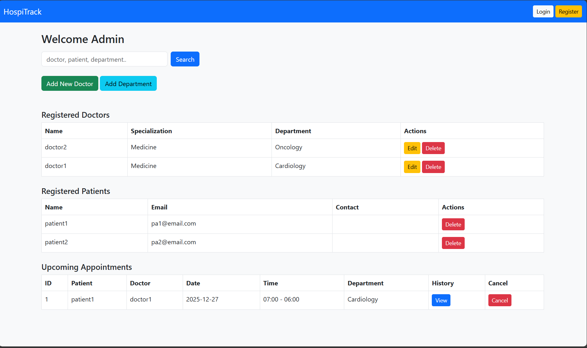
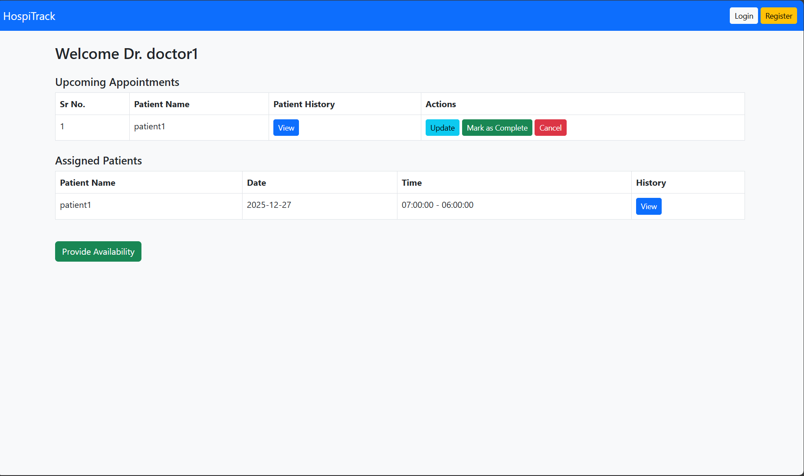
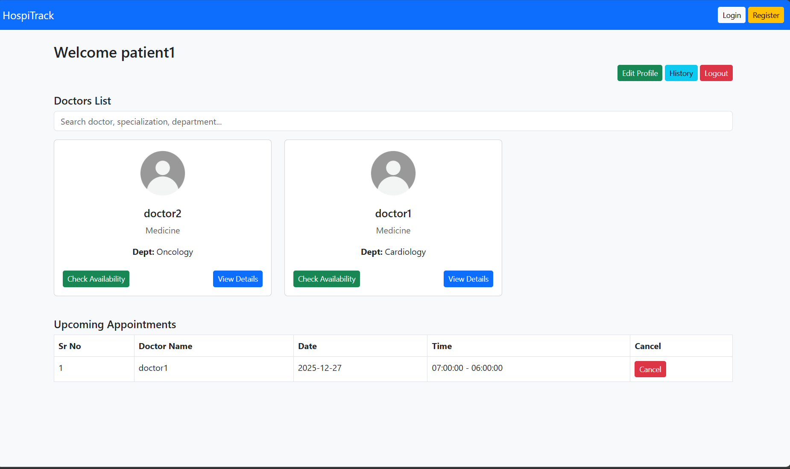

# 🏥 HospiTrack – Hospital Management System

HospiTrack is a role-based hospital management web application built using **Flask**.  
It supports **Admin, Doctor, and Patient** workflows including appointment booking, treatment updates, and history tracking.

---

## 📌 Project Information

- **Name:** HospiTrack  
- **Developer:** Soumyadip Hazari   
- **Course:** MAD 1 – Modern Application Development  

---

## 🚀 Features Overview

### 👤 Authentication & Roles
- Secure login & registration
- Role-based access control:
  - **Admin**
  - **Doctor**
  - **Patient**

---

### 🧑‍💼 Admin Features
- Add and manage doctors
- Create departments
- Assign doctors to departments
- View patients
- View appointment history
- Cancel appointments
- View complete patient history

📸 **Admin Dashboard**


---

### 🧑‍⚕️ Doctor Features
- View assigned appointments
- Set weekly availability
- Update patient diagnosis & prescriptions
- View patient visit history
- Mark appointments as completed or cancelled

📸 **Doctor Dashboard**


---

### 🧑‍🦱 Patient Features
- Search doctors by name, specialization, or department
- View doctor availability
- Book appointments (max **3 per day enforced server-side**)
- Cancel appointments
- View completed appointment history
- Edit profile details

📸 **Patient Dashboard**


---

### 🏠 Landing Page
A minimal homepage introducing the platform with navigation to Login and Register.

📸 **Home Page**


---

## 🗄️ Database Design

### Entities
- **User**
- **Doctor**
- **Patient**
- **Department**
- **Appointment**
- **Treatment**

### Relationships
- User ↔ Doctor (One-to-One)
- User ↔ Patient (One-to-One)
- Department → Doctors (One-to-Many)
- Patient → Appointments (One-to-Many)
- Doctor → Appointments (One-to-Many)
- Appointment ↔ Treatment (One-to-One)

---

## 🔌 API Endpoints (Controller-Based APIs)

Although primarily template-driven, the application exposes **API-style routes** returning JSON and handling CRUD logic.

Examples:
- `GET /patient/search` – search doctors
- `POST /patient/book` – book appointment
- `GET /admin/patient/<id>/history` – patient history
- `POST /doctor/update/<id>` – update treatment

---

## 🛠️ Technologies Used

| Technology | Purpose |
|----------|--------|
| Flask | Backend web framework |
| Flask-Login | Authentication & sessions |
| Flask-SQLAlchemy | ORM for database |
| SQLite | Lightweight database |
| Jinja2 | HTML templating |
| Bootstrap 5 | UI styling |
| Python | Core programming language |

---

## 🧑‍💻 Steps to run this Project on your local machine

### Prerequisites

- Python 3.12+

### Installation (Local)

```bash
# Clone repository
git clone https://github.com/mynkpdr/yantrasolve.git
cd yantrasolve

# Creating venv

python -m venv venv

# Activating Venv

.\venv\Scripts\Activate

# Install dependencies
pip install -r .\requirements.txt
```
### Run

```bash

python .\app.py

```

## 📦 Python Dependencies

Installed via `pip`:

```txt
Flask
Flask-Login
Flask-SQLAlchemy
SQLAlchemy
Jinja2
Werkzeug
itsdangerous
blinker
click
greenlet
typing_extensions